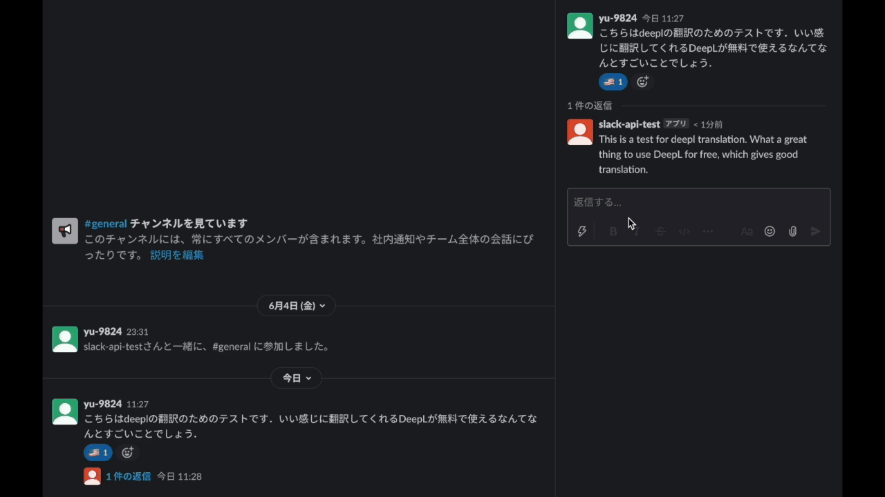

# slack-deepl-translation
## What's this
You can translate Slack messages by DeepL by simply pressing the reaction button.

## Example

## Setup
1. Fork this repository to your account.
2. Install Google Chrome app on your laptop. See [here](https://support.google.com/chrome/answer/95346?co=GENIE.Platform%3DDesktop&hl=ja)(official document).
3. Add [Google Apps Script GitHub Assisitant](https://chrome.google.com/webstore/detail/google-apps-script-github/lfjcgcmkmjjlieihflfhjopckgpelofo) on your Chrome.
4. Create a new project of Google Apps Script.
5. Pull the repository on your project.
    - If you get an error saying, "\[github assistant\] undefined", please go [here](https://script.google.com/u/0/home/usersettings) to turn it on.
6. Add the following to `properties`:
    - deeplApiToken: You have to register [DeepL API Free](https://www.deepl.com/docs-api) and get your `auth_key`.
    - slackApiToken: You have to create slack app and get your `OAuth Tokens for Your Workspace` in "Install App".
    - spreadSheetId: You have to create new Google Spread Sheet and get its ID; https://docs.google.com/spreadsheets/d/**XXXXXXXXX**/edit#gid=0, `XXXXXXXXX` is spread sheet ID.
7. Publish this project as a web application that can be used by everyone.
8. Register the web app's link to the "Event Subscriptions" section of slack.
9. Install app to channels you want to use the web app.

## Notes
This is only for DeepL free API. If you want to use DeepL Pro API, You have to change certain terms, which is not so difficult.
You must be Owner of your aimed workspace.

## LICENSE
See [LICENSE](LICENSE).
